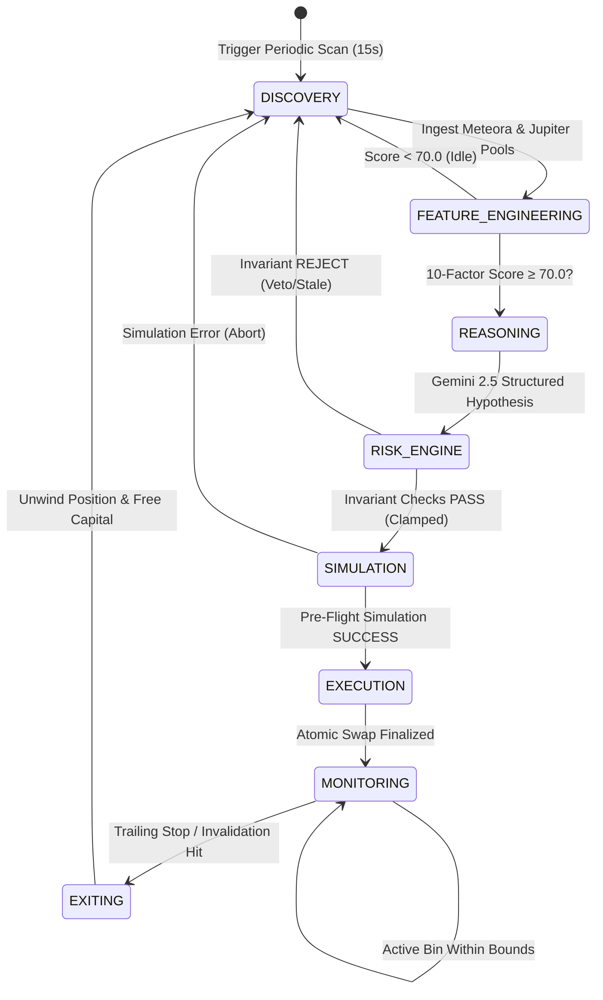

# NEXORA — Autonomous Agent Architecture & Operation Manual

> **Module:** `@nexora/agent`  
> **Status:** Production-Ready (Solana Devnet & Simulation)  
> **Core Principle:** *Deterministic State Automaton with Strict Invariant Bounding*

---

## 1. The 8-Stage Autonomous Trading Loop

NEXORA operates as an asynchronous, deterministic Finite State Machine (FSM). Each cycle executes through 8 discrete stages with sub-second telemetry:



### Stage Summary & Latency Targets

| Stage | Module | Latency Target | Failsafe Boundary |
|---|---|---|---|
| **01. Discovery** | `MarketDiscoveryModule` | &le; 50ms | Filters out pairs with TVL &lt; $50k or 24h volume &lt; $100k. |
| **02. Feature Engineering** | `SignalEngine` | &le; 25ms | Verifies data timestamp freshness &le; 15.0s. |
| **03. AI Reasoning** | `StructuredReasoner` | &le; 1,500ms | Schema validation via Zod; drops proposals if confidence &lt; 70%. |
| **04. Risk Engine** | `InvariantGate` | &le; 5ms | Mathematically clamps position to &le; 10% equity and verifies 50bps slippage. |
| **05. Simulation** | `TransactionSimulator` | &le; 150ms | Simulates transaction against current Solana bank slot. |
| **06. Execution** | `ExecutionOrchestrator` | &le; 500ms | Dispatches atomic swap via Meteora DLMM or Jupiter router. |
| **07. Monitoring** | `PositionMonitor` | Sub-second (15s poll) | Tracks mark price relative to DLMM active bin boundaries and trailing stops. |
| **08. Exiting** | `ExitManager` | &le; 400ms | Executes systematic scale-out or immediate invalidation unwind. |

---

## 2. Structured AI Reasoning & Zod Schema Enforcement

NEXORA does NOT use unstructured text generation for trading decisions. All LLM calls use Gemini 2.5 Flash with structured output schemas:

```typescript
export const NexoraTradeDecisionSchema = z.object({
  market: z.string().min(1),
  venue: z.enum(["METEORA_DLMM", "JUPITER", "RAYDIUM", "ORCA"]),
  action: z.enum(["BUY", "SELL", "HOLD", "DO_NOT_TRADE"]),
  confidence: z.number().min(0).max(100),
  proposedPositionSizePercent: z.number().min(0).max(10.0), // Hard schema cap
  entryReason: z.string().min(10).max(500),
  invalidationReason: z.string().min(10).max(500),
  timeHorizon: z.enum(["SCALP_1M", "SHORT_15M", "MEDIUM_1H", "SWING_4H"]),
  targetTakeProfitPrice: z.number().positive(),
  stopLossPrice: z.number().positive(),
});
```

If the model produces any unparsed fields, invalid values, or confidence below 70.0%, the parser throws a validation error and drops the execution proposal immediately.

---

## 3. The Fail-Closed Deterministic Invariant Shield

The risk engine runs in deterministic code (local Rust / TypeScript) independently of the AI model. It enforces:

1. **Position Sizing Invariant**:
   $$\text{Allocated Size} = \min(\text{Proposed Size}, 0.10 \times \text{Portfolio Equity}, \$1,000.00)$$
2. **Slippage Tolerance Invariant**:
   $$\text{Slippage} \le 50\text{ bps } (0.50\%)$$
3. **Daily Drawdown Circuit Breaker**:
   $$\Delta \text{Equity}_{24\text{h}} \ge -3.0\%$$
4. **Data Freshness Invariant**:
   $$t_{\text{current}} - t_{\text{data}} \le 15.0\text{ seconds}$$

---

## 4. Non-Custodial Session Key Mechanics

- The agent is provisioned with an **ephemeral Ed25519 session keypair** operating strictly in volatile memory (RAM).
- The Anchor PDA Vault program grants the agent **trade-only delegation** up to pre-configured policy limits.
- **Strict Non-Custodial Guarantee**: The smart contract rejects any attempt by the agent public key to execute token transfers or withdrawals. Only the wallet owner can withdraw capital.
- **Emergency Pause**: Both the owner and agent can trigger `emergencyPause` onchain to immediately halt trading. Only the owner can execute `unpause`.

---

## 5. Telemetry & Observable State

The agent continuously publishes observable telemetry consumed by the API server and UI:

```json
{
  "status": "RUNNING",
  "environment": "DEVNET",
  "activeCycleNumber": 1428,
  "lastCycleTimestamp": "2026-10-05T23:05:00.000Z",
  "openPositionsCount": 1,
  "scannedMarketsCount": 42,
  "approvedDecisionsCount": 18,
  "rejectedDecisionsCount": 4,
  "systemHealth": {
    "solanaRpcLatencyMs": 18,
    "jupiterApiLatencyMs": 24,
    "meteoraApiLatencyMs": 32,
    "invariantGateLatencyMs": 4.2
  }
}
```
