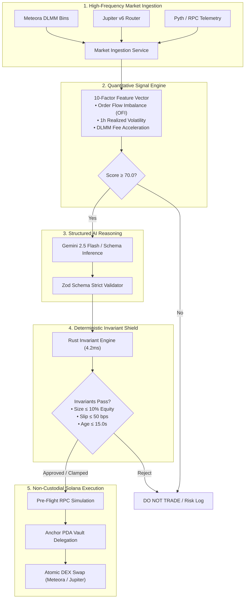

# NEXORA — Autonomous Intelligence for Onchain Solana Markets

<div align="center">

[](https://solana.com)
[](https://bun.sh)
[](https://www.typescriptlang.org)
[](file:///e:/hackathon_solana/docs/10_TESTING.md)
[](LICENSE)

**Autonomous AI agents that discover, evaluate, and execute high-probability opportunities across onchain Solana liquidity venues with mathematical safety.**

[Explore Documentation](docs/01_PRD.md) • [Demo Script](docs/12_DEMO_SCRIPT.md) • [System Design](docs/03_SYSTEM_DESIGN.md) • [Design System](docs/08_DESIGN_SYSTEM.md) • [Audit Report](docs/11_AUDIT.md)

</div>

---

## 1. Core Architectural Doctrine

```
┌─────────────────────────┐       ┌─────────────────────────┐       ┌─────────────────────────┐
│      THE AI DECIDES     │  ──►  │ THE RISK ENGINE CONTROLS │  ──►  │ THE BLOCKCHAIN EXECUTES │
│ (Gemini 2.5 Structured) │       │ (Zero-Bypass Rust Gates)│       │  (Solana DLMM & Anchor) │
└─────────────────────────┘       └─────────────────────────┘       └─────────────────────────┘
```

NEXORA enforces a strict separation of concerns:
1. **The AI Decides**: Ingests high-frequency market telemetry and generates schema-validated trade hypotheses with explicit invalidation conditions.
2. **The Risk Engine Controls**: Evaluates deterministic mathematical invariants (10% max allocation, 50 bps slippage, -3% daily drawdown) in sub-millisecond Rust, clamping or vetoing proposals with zero human latency.
3. **The Blockchain Executes**: Non-custodial delegated execution via Anchor Program Derived Address (PDA) vaults on Solana with pre-flight simulation and dynamic priority fees.

---

## 2. System Architecture



---

## 3. Monorepo Structure

```
NEXORA/
│
├── .agents/
│   └── skills/                # Agent design and UX guidelines
│
├── docs/
│   ├── 01_PRD.md              # Product Requirements Document
│   ├── 02_SRS.md              # Software Requirements Specification
│   ├── 03_SYSTEM_DESIGN.md    # System Architecture & Component Interactions
│   ├── 04_AGENT_ARCHITECTURE.md # AI Hypothesis & Finite State Machine
│   ├── 05_TRADING_STRATEGY.md # 10-Factor Scoring & DLMM Volatility Capture
│   ├── 06_RISK_SECURITY.md    # Threat Model & Mathematical Invariants
│   ├── 07_SOLANA_ARCHITECTURE.md # Solana Native Account Model & PDAs
│   ├── 08_DESIGN_SYSTEM.md    # 3-Layer Design Tokens & Institutional UI
│   ├── 09_UI_UX.md            # Workstation Layout & Information Density
│   ├── 10_TESTING.md          # 94-Test Verification Matrix
│   ├── 11_AUDIT.md            # Senior Review & Anti-Slop Remediation
│   └── 12_DEMO_SCRIPT.md      # Hackathon 3-Minute Presentation Guide
│
├── apps/
│   ├── web/                   # High-Density React 18 + Vite Trading Terminal
│   └── api/                   # Bun High-Throughput REST & Telemetry Server
│
├── packages/
│   ├── agent/                 # Autonomous FSM Trading Loop Controller
│   ├── strategy/              # 10-Factor Vector & Opportunity Scoring
│   ├── risk-engine/           # Deterministic Invariant Verification Shield
│   ├── execution/             # Meteora DLMM & Jupiter Route Providers
│   ├── solana/                # Anchor Vault PDA, Keypair, & Tx Simulator
│   ├── data/                  # Live & Mock Market Ingestion Adapters
│   ├── database/              # Typed Database & Fast Memory Store
│   ├── shared/                # Universal Schemas, Types, & Math Helpers
│   └── ui/                    # Institutional Design Tokens & Formatters
│
├── programs/
│   └── vault/                 # Anchor Smart Contract (Non-Custodial Vault)
│
├── AGENTS.md                  # Autonomous Agent Engineering Guide
├── README.md                  # Monorepo Master Documentation
└── package.json               # Monorepo Workspace Configuration
```

---

## 4. Deterministic Risk Invariants

All AI proposals are subject to hard mathematical constraints evaluated by the fail-closed Risk Engine:

| Invariant Rule | Protocol Boundary | Enforcement Layer | Automated Action |
|---|---|---|---|
| **Max Position Size** | &le; 10.0% Portfolio Equity ($1,000 Cap) | Rust Risk Engine + Anchor PDA | Clamps position size down automatically |
| **Max Slippage** | &le; 50 bps (0.50%) | Quote Verifier & Tx Builder | Aborts transaction pre-flight |
| **Daily Drawdown** | &le; -3.0% 24h Session Loss | Real-Time Portfolio Monitor | Freezes trading for 24 hours |
| **Data Freshness** | &le; 15.0 Seconds Age | Ingestion Freshness Guard | Immediate `DO NOT TRADE` reject |
| **AI Confidence** | &ge; 70.0% Confidence Score | Zod Schema Validator | Drops execution proposal |
| **Non-Custodial Vault** | Trade-Only Delegation | Anchor PDA Program | Agent cannot withdraw capital |

---

## 5. Quickstart & Local Development

### Prerequisites
- [Bun](https://bun.sh) (v1.1 or higher)
- Node.js 18+

### 1. Installation
```bash
git clone https://github.com/MayankSen09/nexora_agent-.git
cd nexora_agent-
bun install
```

### 2. Run Test Suite
```bash
# Runs 94 unit and integration tests across all packages
bun test src
```

### 3. Build Web Production Bundle
```bash
# Typechecks and builds the Vite production application
bun run --filter @nexora/web build
```

### 4. Start Local Development Servers
```bash
# Terminal 1: Launch API Server (Port 3001)
bun run apps/api/src/index.ts

# Terminal 2: Launch Web Trading Terminal (Port 5173)
cd apps/web && bun run dev
```

Open [http://localhost:5173](http://localhost:5173) in your browser.

---

## 6. Verification Status

- **Unit & Integration Tests:** 94 / 94 Passing (0 Failures)
- **TypeScript Typecheck:** Clean across all 9 packages and 2 applications.
- **Design System Compliance:** Verified against `docs/08_DESIGN_SYSTEM.md` and `docs/11_AUDIT.md`.
- **Accessibility:** WCAG 2.1 AA compliant modal dialogs with focus trapping and `Escape` listeners.

---

## 7. License

MIT License. Engineered for the Solana Hackathon.
