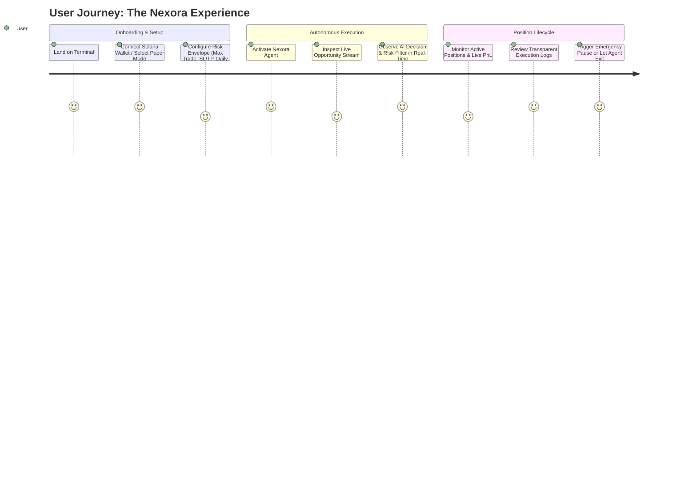
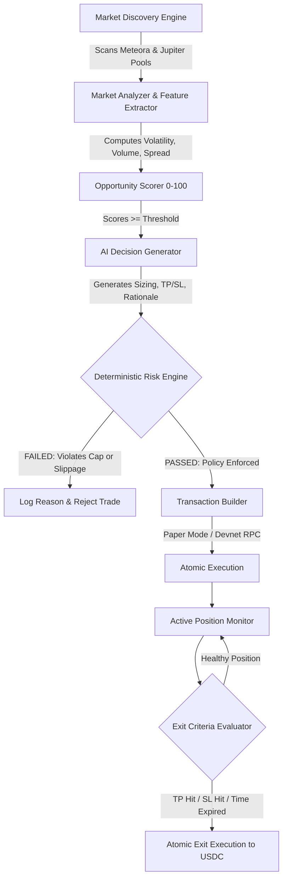

# NEXORA — Product Requirements Document (PRD)

> **Document Version:** 1.0.0  
> **Status:** Approved / Base Specification  
> **Target Track:** Solana Hackathon — AI & DeFi Infrastructure  
> **Date:** October 2026  
> **Working Name:** NEXORA  
> **Tagline:** *Autonomous Intelligence for Onchain Markets.*  
> **Product Category:** Autonomous AI Trading Infrastructure for Solana  

---

## 1. Executive Summary

**NEXORA** is a next-generation autonomous onchain capital allocation and trading system built natively for the Solana ecosystem. 

Unlike conversational "AI wrapper" trading bots, Nexora functions as an institutional-grade, continuous autonomous execution system. It pairs probabilistic AI market discovery and opportunity scoring with a **deterministic risk engine and cryptographically enforced policy layer**. 

Nexora continuously scans high-velocity onchain liquidity venues (primarily **Meteora DLMM / dynamic AMMs** and **Jupiter Aggregator**), generates structured trade hypotheses with verifiable rationales, screens every proposed action against user-defined hard risk boundaries, executes via Solana's sub-second finality, and monitors position health through dynamic, algorithmic exit policies.

```
┌─────────────────────────────────────────────────────────────────────────────┐
│                             THE NEXORA DOCTRINE                             │
├───────────────────┬───────────────────┬───────────────────┬─────────────────┤
│   THE AI DECIDES  │  THE RISK ENGINE  │  THE POLICY LAYER │  THE BLOCKCHAIN │
│                   │      CONTROLS     │      ENFORCES     │     EXECUTES    │
│  Probabilistic    │  Deterministic    │  Cryptographic &  │  Atomic, Fast,  │
│  Alpha Discovery  │  Safety & Caps    │  Rule-Based Gates │  Low-Slippage   │
└───────────────────┴───────────────────┴───────────────────┴─────────────────┘
```

---

## 2. Problem Statement

### 2.1 The Retail & AI Bot Dilemma
1. **The "Black-Box" Bot Trap:** Existing crypto AI bots rely on opaque LLM prompts to directly trigger wallet transactions. A single hallucination or edge-case market anomaly can drain liquidity or execute catastrophic trades.
2. **24/7 Liquidity Dynamics on Solana:** High-yield opportunities on venues like Meteora DLMM (Dynamic Liquidity Market Maker) and rapid volatility shifts routed through Jupiter require real-time rebalancing, order placement, and risk monitoring that human traders cannot maintain 24/7.
3. **Absence of Explainable Alpha:** Most trading algorithms execute silently without human-verifiable rationales, making it impossible for capital allocators to audit strategy effectiveness or risk exposure.
4. **Lack of Hard Failsafes:** Conventional algorithmic trading bots lack deterministic circuit breakers, exposing portfolios to MEV front-running, unbounded slippage, illiquid rug-pulls, and runaway drawdown loops.

---

## 3. Target Users & Personas

### 3.1 Target Users
- **Active Solana DeFi Traders & Yield Farmers:** Users seeking systematic execution across volatile pairs and high-fee Meteora DLMM bins without spending 16 hours a day monitoring charts.
- **Quantitative & Algorithmic Capital Allocators:** Independent funds and prop traders seeking transparent, risk-bounded onchain execution infrastructure.
- **Solana Power Users:** Ecosystem participants holding USDC/SOL who want disciplined, automated portfolio growth under strict, user-governed parameters.

### 3.2 User Personas

```
┌───────────────────────────────────────┬───────────────────────────────────────┐
│ PERSONA 1: "The Systematic Allocator" │ PERSONA 2: "The High-Velocity Farmer" │
├───────────────────────────────────────┼───────────────────────────────────────┤
│ • Background: Ex-TradFi / Quant Trader│ • Background: Crypto Native / Degenerate│
│ • Goal: Steady risk-adjusted yield.   │ • Goal: Capture rapid DLMM fee surges.│
│ • Frustration: Hallucinating AI tools │ • Frustration: Missing volatile spikes│
│   and unexplainable losses.           │   and failing to exit on drawdowns.   │
│ • Requirement: Hard stop-loss bounds, │ • Requirement: Real-time discovery,   │
│   detailed audit logs, and kill-switch│   Jupiter swap routing, instant fills.│
└───────────────────────────────────────┴───────────────────────────────────────┘
```

---

## 4. Product Vision & Positioning

### 4.1 Vision
To establish the global gold standard for autonomous onchain capital allocation, where artificial intelligence discovers market inefficiencies, and deterministic smart contract code guarantees systemic capital preservation.

### 4.2 Positioning

| What NEXORA IS NOT | What NEXORA IS |
|---|---|
| ❌ "ChatGPT with a private key" |  **An Autonomous Capital Allocation System** |
| ❌ A black-box signals telegram bot |  **A Verifiable, Multi-Tier Risk-Gated Trading Engine** |
| ❌ A generic SaaS crypto tracker |  **A High-Density Quantitative Financial Workstation** |
| ❌ A meme-token lottery roller |  **A Disciplined Liquidity & Momentum Capture System** |

---

## 5. Core Value Proposition

1. **Continuous Autonomous Discovery:** Scans Meteora DLMM pools and Jupiter routes every block for volume/liquidity imbalances, momentum breakouts, and dynamic fee anomalies.
2. **Deterministic Risk Invariants:** No trade bypasses the risk layer. Hard maximum slippage, per-trade capital caps, maximum daily drawdown, and liquidity depth requirements are mathematically validated before transaction signing.
3. **Complete Decision Explainability:** Every trade proposal produces an immutable Decision Breakdown (Context, Metrics, Scoring, Expected Value, Sizing Rationale, and Exit Plan).
4. **Zero-Trust Safety & Emergency Pause:** Hardware-level or one-click Emergency Kill-Switch to freeze all autonomous loops, cancel pending orders, or liquidate open positions to USDC.

---

## 6. Primary Use Cases

1. **Autonomous Volatility & Momentum Capture:** Identifying and capturing high-conviction breakout trades on Solana tokens paired against USDC via Jupiter.
2. **Meteora Dynamic Fee Harvester:** Systematically deploying capital into high-volume Meteora DLMM active bins during volatility surges, harvesting dynamic fees, and withdrawing when volatility subsides.
3. **Autonomous Risk Management & Position Guard:** Continuous position tracking with dynamic trailing stops, profit taking targets, and time-based exits without user intervention.
4. **Paper Trading & Strategy Backtesting:** Simulated forward-testing with live mainnet market feeds to validate AI models and risk rules with zero capital at risk.

---

## 7. MVP Scope vs. Post-MVP Scope

```
┌─────────────────────────────────────────────────────────────────────────────┐
│                               SCOPE BREAKDOWN                               │
├──────────────────────────────────────┬──────────────────────────────────────┤
│               MVP SCOPE              │            POST-MVP SCOPE            │
│          (Hackathon Target)          │          (Future Protocol)           │
├──────────────────────────────────────┼──────────────────────────────────────┤
│ • Market Discovery Engine            │ • Multi-Agent Consensus Swarms       │
│ • AI Decision Matrix & Explanations  │ • Cross-Chain Liquidity Routing      │
│ • Deterministic Risk Validator       │ • Custom Smart Contract Vaults (SPL) │
│ • Jupiter v6 Swap & Meteora Pools    │ • Zero-Knowledge Verifiable Inference│
│ • Dual Mode: Paper & Devnet (Default)│ • Social Copy-Trading Infrastructure │
│ • Real-time Terminal UI & PnL Monitor│ • Flashloan Arbitrage Modules        │
│ • One-Click Global Emergency Pause   │ • Mobile Native App (iOS/Android)    │
│ • Simulated Trade History & Auditing │ • Multi-Sig Treasury Allocators      │
└──────────────────────────────────────┴──────────────────────────────────────┘
```

---

## 8. Detailed Functional Requirements

### 8.1 Market Discovery Engine
- **Data Ingestion:** Streams pool metrics, 24h volume, TVL, price action, and fee growth from Solana RPCs, Jupiter Price API, and Meteora DLMM program accounts.
- **Opportunity Screener:** Filters pools based on minimum liquidity threshold ($50k+), minimum 24h volume, and verifiable token mint security.
- **Opportunity Scoring (0–100):** Multi-factor scoring combining volatility, volume/TVL ratio, spread stability, and trend momentum.

### 8.2 AI Decision Generator
- **Reasoning Loop:** Takes current market state and generates a structured trade hypothesis (`DECIDE_BUY`, `DECIDE_SELL`, `HOLD`, `REBALANCE`).
- **Structured Output Schema:**
  - `target_pair`: Base/Quote mints
  - `action`: BUY / SELL / REBALANCE
  - `confidence_score`: 0.00 – 1.00
  - `suggested_size_usdc`: Suggested sizing
  - `entry_range`: [Min, Max]
  - `target_take_profit`: Price target (+X%)
  - `stop_loss_price`: Invalidation price (-Y%)
  - `max_hold_time_minutes`: Time-based exit limit
  - `rationale`: Clear 2–3 sentence financial breakdown

### 8.3 Deterministic Risk Engine & Policy Layer
- **Mandatory Invariants (Hard Gates):**
  1. `MAX_POSITION_SIZE_USDC`: Hard cap per single trade (e.g., max 10% of portfolio).
  2. `MAX_DAILY_DRAWDOWN_PCT`: Circuit breaker halts all trading if portfolio loses > X% in 24h.
  3. `MAX_SLIPPAGE_BPS`: Max permissible slippage (e.g. 50 bps / 0.5%).
  4. `MIN_LIQUIDITY_DEPTH_USDC`: Rejects any trade where price impact exceeds 1.0%.
  5. `MAX_OPEN_POSITIONS`: Maximum concurrent active positions (e.g., 3-5).
  6. `SANCTIONED_MINTS_ONLY`: Whitelist of tradeable quote assets (USDC, SOL, JupSOL).

### 8.4 Execution Layer (Jupiter & Meteora)
- **Jupiter Integration:** Optimal route computation, split routes, price impact validation, and transaction building.
- **Meteora Integration:** DLMM active bin identification and swap execution.
- **Execution Modes:**
  - `PAPER_TRADING` (Default on load): Real-time live prices with zero-risk simulated wallet execution.
  - `DEVNET`: Live onchain transactions using Solana Devnet RPC and faucet USDC/SOL.
  - `MAINNET` (Disabled by default): Locked behind explicit multi-step confirmation and safety checks.

### 8.5 Position Monitoring & Exit Engine
- **Continuous Mark-to-Market:** Real-time PnL tracking updated per block.
- **Deterministic Auto-Exit Triggers:**
  - Take Profit (TP) limit hit.
  - Stop Loss (SL) market trigger hit.
  - Trailing Stop adjustment.
  - Max Hold Time expiration (auto-unwind stale positions).

### 8.6 Portfolio Tracking & Audit Logs
- **Portfolio Summary:** Total Equity (USDC), Available Balance, Allocated Capital, Unrealized PnL, Realized PnL, Win Rate, Sharpe Ratio estimate.
- **Live Decision Ledger:** Chronological feed of every evaluated opportunity, scored parameter, AI rationale, risk verdict (APPROVED vs. REJECTED), and execution receipt.

### 8.7 Global Safety Controls
- **Emergency Pause ("Kill Switch"):** Immediately cancels all active agent loops.
- **Panic Liquidation:** Atomically swaps all open positions back into USDC via Jupiter.

---

## 9. Non-Goals (What We Will NOT Build for Hackathon MVP)

1. **No Real-Money Forced Autonomy:** We will not force users into live mainnet trading. Default state is paper/devnet.
2. **No Telegram/Discord Chat Bot Interface:** We are building a high-density, professional web trading terminal, not a conversational chatbot.
3. **No Unaudited Complex Smart Contract Vaults:** Execution will be client-side with user-connected Solana wallets (Phantom, Solflare) or delegated local keypairs, avoiding unverified onchain vault custody risks for MVP.
4. **No Uncapped Leveraged Derivatives:** We focus on spot liquidity and dynamic AMM swaps (USDC pairs). No perpetual futures liquidation cascades.

---

## 10. User Journeys



---

## 11. Agent Journey & Trading Lifecycle



---

## 12. Hackathon Differentiation Matrix

| Dimension | Conventional Crypto AI Bots | NEXORA |
|---|---|---|
| **Architecture** | Chatbot / Wrapper prompt | **Autonomous Dual-Core (AI Brain + Deterministic Risk Shield)** |
| **Risk Control** | Probabilistic (Model decides risk) | **Deterministic (Code enforces math & caps)** |
| **Transparency** | Black box ("Bought token X") | **Full Explainable Decision Ledger (Metrics + Rationale)** |
| **Solana Integration**| Generic swaps | **Meteora DLMM & Jupiter Aggregator native** |
| **UX & Aesthetics** | Generic SaaS / Telegram UI | **Institutional Quant Terminal (Bloomberg/Linear-grade)** |
| **Safety Standard** | Live mainnet risk by default | **Paper Trading & Devnet Default with Kill Switch** |

---

## 13. Success Metrics

### 13.1 Hackathon Evaluation Metrics
- **Functionality:** 100% working discovery, analysis, scoring, risk validation, and execution cycle.
- **Latency:** Sub-second market analysis and trade construction cycle.
- **Reliability:** 0 unhandled exceptions or runaway execution loops.
- **UX Excellence:** Flawless visual hierarchy, responsive layout, tabular data rendering, and dark-mode aesthetics adhering to [`SKILL_USAGE.md`](file:///e:/hackathon_solana/docs/SKILL_USAGE.md).

### 13.2 Product Trading Performance Metrics
- **Win Rate %** on Paper / Devnet trading loops.
- **Max Drawdown %** maintained strictly within user-configured threshold.
- **Execution Slippage vs. Quoted Price** (< 0.2% variance).

---

## 14. Product Risks & Mitigations

| Risk | Impact | Mitigation Strategy |
|---|---|---|
| **AI Model Hallucination** | HIGH | Hard deterministic risk filters reject any trade exceeding size, slippage, or liquidity constraints regardless of AI confidence. |
| **RPC Rate Limiting & Outages** | MEDIUM | Fallback RPC providers and graceful backoff retries with degraded state alerts. |
| **Low Liquidity / Slippage Spikes** | HIGH | Pre-trade Jupiter quote simulation checking maximum price impact threshold before broadcast. |
| **Runaway Loss Loop** | CRITICAL | Hard 24h drawdown limit automatically flips the system into `EMERGENCY_PAUSED` state. |

---

## 15. Future Roadmap

```
┌─────────────────────────────────────────────────────────────────────────────┐
│                              NEXORA ROADMAP                                 │
├───────────────────────┬─────────────────────────────┬───────────────────────┤
│ PHASE 1: HACKATHON    │ PHASE 2: PROTOCOL EXPANSION │ PHASE 3: INSTITUTIONAL│
│ (Current Milestone)   │ (Q4 2026)                   │ (2027)                │
├───────────────────────┼─────────────────────────────┼───────────────────────┤
│ • Complete Terminal UI│ • Non-Custodial SPL Vaults  │ • Multi-Agent Swarms  │
│ • Paper & Devnet Mode │ • Dynamic DLMM LP Manager   │ • ZK Proof of Compute │
│ • Jupiter + Meteora   │ • Mainnet Alpha Opt-In      │ • Cross-Chain Routing │
│ • Decision Ledger     │ • Backtesting Visualizer    │ • Institutional API   │
└───────────────────────┴─────────────────────────────┴───────────────────────┘
```
