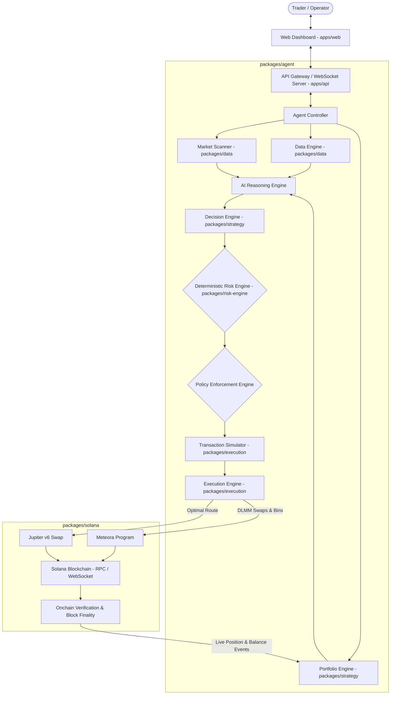
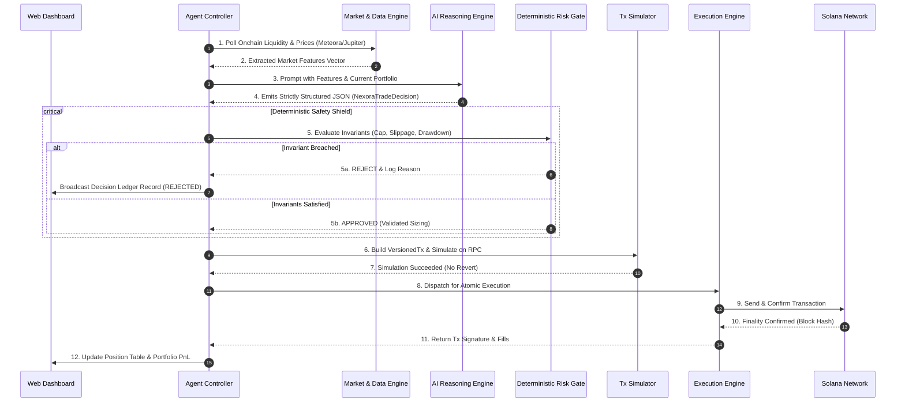
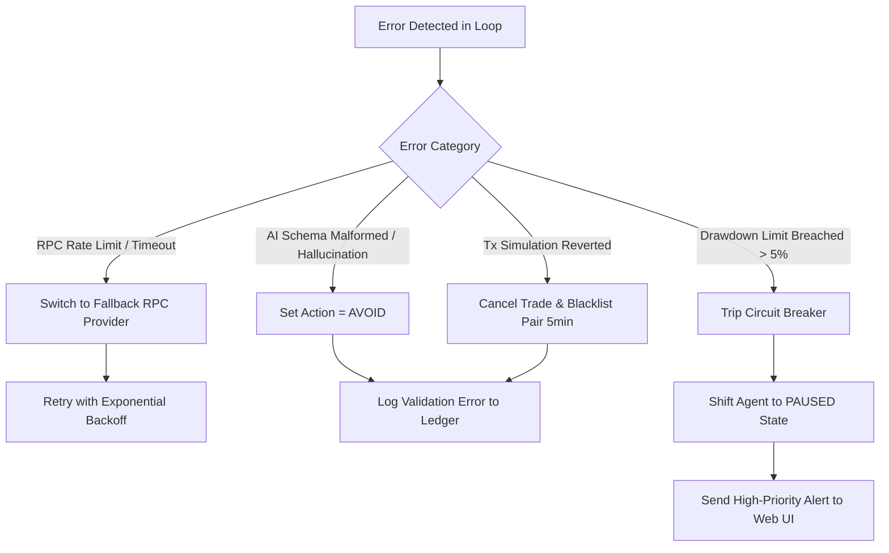

# NEXORA — Technical System Architecture & System Design

> **Document Version:** 1.0.0  
> **Status:** Approved Engineering Blueprint  
> **Target Track:** Solana Hackathon — AI & DeFi Infrastructure  
> **Document Identifier:** NEX-ARCH-V1  
> **Companion Documents:** [`docs/01_PRD.md`](file:///e:/hackathon_solana/docs/01_PRD.md), [`docs/02_SRS.md`](file:///e:/hackathon_solana/docs/02_SRS.md)  

---

## 1. High-Level System Architecture

NEXORA is engineered as a **high-throughput, modular TypeScript monolith** that pairs asynchronous market ingestion and probabilistic AI reasoning with synchronous, zero-bypass deterministic risk control and atomic Solana execution.



---

## 2. Monorepo Package Structure

To maximize development velocity during the hackathon without sacrificing clean architectural boundaries, Nexora uses a **Turborepo / Bun-powered Modular Monolith**:

```
nexora/
├── apps/
│   ├── web/                     # Next.js / Vite high-density trading terminal (React 19, Tailwind CSS)
│   └── api/                     # Node/Bun Fastify API Gateway & WebSocket Event Hub
├── packages/
│   ├── agent/                   # Agent loop scheduler, state machine, and orchestrator
│   ├── strategy/                # Quantitative feature extraction, signals & scoring algorithms
│   ├── risk-engine/             # Mathematical risk invariants, drawdown checkers, sizing caps
│   ├── execution/               # Transaction serializer, priority fee manager, simulation engine
│   ├── solana/                  # Solana RPC connection pool, Wallet Adapter bridge, Account listeners
│   ├── data/                    # Jupiter & Meteora stream parsers, candle builders, market scrapers
│   ├── database/                # SQLite/Prisma local persistence for paper trades & audit logs
│   └── shared/                  # Shared TypeScript types, Zod schemas, constants, error codes
├── programs/
│   └── vault/                   # (Post-MVP) Anchor smart contract for delegated non-custodial custody
└── docs/                        # Specifications, PRD, SRS, and architecture documentation
```

---

## 3. Deep Component Specifications

```
┌─────────────────────────────────────────────────────────────────────────────┐
│                            COMPONENT SPEC MATRIX                            │
├───────────────────┬───────────────────┬───────────────────┬─────────────────┤
│ 1. Web Dashboard  │ 4. Market Scanner │ 7. Risk Engine    │ 10. Exec Engine │
│ 2. API Gateway    │ 5. Data Engine    │ 8. Policy Engine  │ 11. Jupiter Int │
│ 3. Agent Ctlr     │ 6. AI Reasoning   │ 9. Tx Simulator   │ 12. Meteora Int │
└───────────────────┴───────────────────┴───────────────────┴─────────────────┘
```

---

### 3.1 Web Dashboard (`apps/web`)
- **Responsibility:** High-density financial UI rendering, real-time market depth, PnL monitoring, Decision Ledger display, wallet connection, and Emergency Kill-Switch control.
- **Inputs:** User clicks/configuration, WebSocket event streams (ticks, agent states, positions, logs).
- **Outputs:** Signed transaction payloads, agent state toggle commands, risk configuration updates.
- **Dependencies:** React, Tailwind CSS, `@solana/wallet-adapter-react`, Lucide/Phosphor Icons, Chart.js.
- **APIs:** REST (`/api/v1/agent/*`, `/api/v1/portfolio/*`) and WebSocket (`ws://api/events`).
- **Failure Modes:** UI disconnects gracefully on network loss; reconnects automatically with backoff.
- **Security Considerations:** No private keys stored in DOM/localStorage; CSP restricts external script injection.

---

### 3.2 API Gateway & Event Hub (`apps/api`)
- **Responsibility:** Request routing, WebSocket connection management, SIWS session authentication, rate limiting, and event multiplexing.
- **Inputs:** Client HTTP/WS requests, internal agent state changes.
- **Outputs:** Authenticated JSON responses, broadcasted WebSocket event frames.
- **Dependencies:** Fastify / uWebSockets, `@solana/web3.js`, Zod.
- **Failure Modes:** Graceful HTTP 503 on service overload; client queueing.
- **Security Considerations:** Enforces input schema validation via Zod on all endpoints; strict CORS.

---

### 3.3 Agent Controller (`packages/agent`)
- **Responsibility:** Master lifecycle orchestrator. Manages execution cycles, interval timers, state transitions (`SCANNING` ➔ `ANALYZING` ➔ `EVALUATING_RISK` ➔ `EXECUTING`), and kill-switch overrides.
- **Inputs:** Start/Stop/Pause signals, ticker intervals (5s–30s).
- **Outputs:** State transition broadcasts, scheduled task invocations.
- **Dependencies:** `packages/shared`, `packages/data`, `packages/strategy`, `packages/risk-engine`.
- **Failure Modes:** Catches unhandled exceptions in the loop, shifts agent to `ERROR` state, logs stack trace, and alerts UI without crashing server process.
- **Security Considerations:** The Kill-Switch operates on a dedicated high-priority interrupt handler.

---

### 3.4 Market Scanner (`packages/data`)
- **Responsibility:** Continuously scans onchain liquidity pools across Meteora DLMM and Jupiter token registry.
- **Inputs:** Solana RPC getProgramAccounts, Jupiter Token API, Meteora REST endpoints.
- **Outputs:** Ranked candidate market list: `Array<CandidatePool>`.
- **Dependencies:** `@solana/web3.js`, `packages/shared`.
- **APIs:** `Meteora API: /pairs`, `Jupiter Price API: /v2/price`.
- **Failure Modes:** Uses cached pool metadata if external REST endpoints rate-limit or fail.
- **Security Considerations:** Validates all mint addresses against verified token registries.

---

### 3.5 Data Engine & Feature Extractor (`packages/data`)
- **Responsibility:** Builds quantitative technical feature vectors from raw market feeds (volatility $\sigma$, volume momentum, spread, DLMM fee APR, depth).
- **Inputs:** Time-series price ticks, pool reserve changes.
- **Outputs:** `MarketFeatures` object.
- **Dependencies:** `mathjs`, `packages/shared`.
- **Failure Modes:** Returns null/insufficient data flag if price history has gaps.
- **Security Considerations:** Sanitizes NaN and infinite values to prevent AI prompt/inference corruptions.

---

### 3.6 AI Reasoning Engine (`packages/agent`)
- **Responsibility:** Transforms normalized quantitative feature vectors into a structured trade hypothesis using an LLM / reasoning model.
- **Inputs:** `MarketFeatures`, `CurrentPortfolioState`, `ActivePositions`.
- **Outputs:** Structured JSON matching `NexoraTradeDecision` schema.
- **Dependencies:** Google GenAI SDK (`@google/genai`), Zod.
- **Failure Modes:** Schema parsing error or timeout triggers automatic fallback to `action: "AVOID"` with zero trade execution.
- **Security Considerations:** AI output has zero direct access to Solana signing primitives or RPC broadcast functions.

---

### 3.7 Deterministic Risk Engine (`packages/risk-engine`)
- **Responsibility:** Immutable mathematical validator. Screens every trade proposal against hard invariants (Max Position Size, 24h Max Drawdown, Max Slippage, Min Liquidity).
- **Inputs:** `NexoraTradeDecision`, `PortfolioRiskState`, `ProposedSwapParameters`.
- **Outputs:** `RiskEvaluationResult` (`{ approved: boolean, reason?: string, clampedSize?: number }`).
- **Dependencies:** `packages/shared`.
- **Failure Modes:** Fail-closed design (any evaluation error or undefined variable = immediate `REJECT`).
- **Security Considerations:** Completely deterministic code isolated from AI reasoning; zero network or dynamic eval dependencies.

---

### 3.8 Policy Enforcement Engine (`packages/risk-engine`)
- **Responsibility:** Enforces protocol-level constraints (trading hours, whitelisted quote mints, daily volume quotas, execution environment checks).
- **Inputs:** `RiskEvaluationResult`, `PolicyConfig`.
- **Outputs:** Final execution authorization token / payload.
- **Dependencies:** `packages/shared`.
- **Failure Modes:** Rejects trade if policy configuration is invalid or missing.

---

### 3.9 Transaction Simulator (`packages/execution`)
- **Responsibility:** Simulates transactions prior to onchain broadcast to detect front-running, slippage violations, or potential revert errors.
- **Inputs:** Unsigned / simulated VersionedTransaction, Solana RPC connection.
- **Outputs:** Simulation result (Compute Units consumed, simulated return amount, logs).
- **Dependencies:** `@solana/web3.js`.
- **APIs:** `simulateTransaction` on Solana RPC.
- **Failure Modes:** Reverts trade if simulated price impact > max allowed threshold.
- **Security Considerations:** Prevents burning user SOL on transaction revert gas fees.

---

### 3.10 Execution Engine (`packages/execution`)
- **Responsibility:** Builds, serializes, priority-fee adjusts, signs (via local keypair or connected wallet request), and broadcasts atomic transactions to the Solana network.
- **Inputs:** Approved trade parameters, Wallet Signer / Local Keypair.
- **Outputs:** Confirmed transaction signature (`TxSignature`), execution receipt.
- **Dependencies:** `@solana/web3.js`, `@jup-ag/api`, `packages/solana`.
- **Failure Modes:** Automatic retries with exponential backoff on blockhash expiry.
- **Security Considerations:** Enforces minimum output amounts directly in smart contract instruction data.

---

### 3.11 Jupiter & Meteora Integration (`packages/solana`)
- **Responsibility:** Direct SDK integration with Jupiter v6 Swap API and Meteora DLMM program instructions for route generation and bin manipulation.
- **Inputs:** Token in/out mints, amount, max slippage bps.
- **Outputs:** Serialized VersionedTransaction instructions.
- **Dependencies:** `@jup-ag/api`, `@meteora-ag/dlmm`.

---

## 4. System Data Flows & Lifecycles

### 4.1 Master Trading Lifecycle Flow


---

### 4.2 Error Handling & Circuit Breaker Flow


---

### 4.3 Real-Time WebSocket Event Stream
The API Gateway broadcasts strongly typed events to the Web Dashboard over a unified WebSocket connection:

| Event Type | Payload Data | Trigger Interval / Condition |
|---|---|---|
| `TICK_UPDATE` | Price, Volume, Spread for watched pairs | Every 1,000ms |
| `AGENT_STATE` | `state`, `uptime`, `cycle_count`, `active_task` | On state change |
| `DECISION_LOG` | `decision`, `risk_verdict`, `rationale`, `timestamp` | Every evaluation cycle |
| `POSITION_UPDATE` | Open positions, mark-to-market PnL, SL/TP levels | Every Solana block (400ms) |
| `PORTFOLIO_UPDATE`| Total Equity, Unrealized PnL, Available Cash | On position change or tick |
| `ALERT` | Warning / Error messages, Kill-Switch trip | Immediate on occurrence |

---

## 5. Security & Isolation Architecture

```
┌─────────────────────────────────────────────────────────────────────────────┐
│                        SECURITY DOMAIN BOUNDARIES                           │
├────────────────────────┬──────────────────────────┬─────────────────────────┤
│ UNTRUSTED / PROBABILISTIC│    DETERMINISTIC GATES   │   TRUSTED / EXECUTION   │
├────────────────────────┼──────────────────────────┼─────────────────────────┤
│ • AI Reasoning Engine  │ • Deterministic Risk Gate│ • Solana Wallet Adapter │
│ • External REST Feeds  │ • Sizing Clamping Logic  │ • Local Keypair Signer  │
│ • Unverified Liquidity │ • 24h Drawdown Breaker   │ • Atomic Swap Builders  │
│ • Raw Market Ticks     │ • Token Mint Whitelist   │ • Verified RPC Broadcaster│
└────────────────────────┴──────────────────────────┴─────────────────────────┘
```

1. **Isolation of AI Output:** The AI output is treated strictly as an untrusted input. The execution engine cannot ingest AI text directly; it only accepts cryptographically verified, risk-approved execution payloads.
2. **Deterministic Fail-Closed Design:** In the event of missing risk variables, NaN inputs, or execution timeouts, the system defaults immediately to `ABORT_TRADE`.
3. **No Centralized Key Custody:** In Paper Trading mode, simulated wallets are used. In Live mode, keys remain in user browser extensions (Phantom/Solflare) or local session memory with strict hardware revocation.
