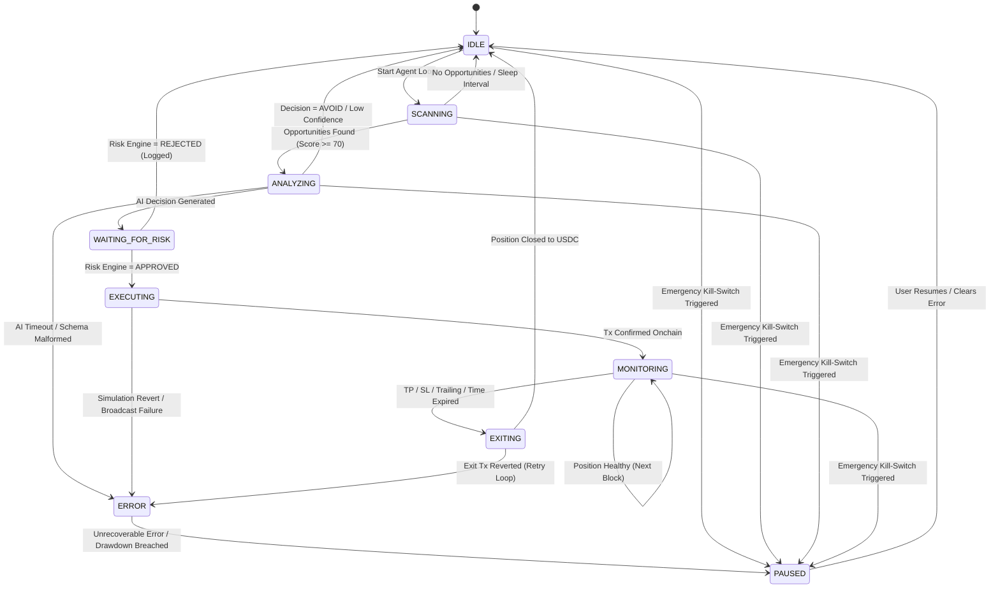

# NEXORA — Autonomous Trading Agent Architecture

> **Document Version:** 1.0.0  
> **Status:** Approved Autonomous Agent Specification  
> **Target Track:** Solana Hackathon — AI & DeFi Infrastructure  
> **Document Identifier:** NEX-AGENT-V1  
> **Companion Documents:** [`docs/01_PRD.md`](file:///e:/hackathon_solana/docs/01_PRD.md), [`docs/02_SRS.md`](file:///e:/hackathon_solana/docs/02_SRS.md), [`docs/03_SYSTEM_DESIGN.md`](file:///e:/hackathon_solana/docs/03_SYSTEM_DESIGN.md)  

---

## 1. Executive Agent Architecture Overview

**NEXORA is NOT a single monolithic LLM prompt.** 

A single prompt combining discovery, math, risk, and execution is fragile, slow, prone to hallucinations, and fundamentally unsafe for capital allocation.

Instead, Nexora utilizes a **Decomposed Multi-Stage Autonomous Pipeline**, separating high-speed quantitative data ingestion and mathematical signal scoring from structured AI contextual reasoning and deterministic risk validation.

```
┌─────────────────────────────────────────────────────────────────────────────┐
│                    NEXORA AUTONOMOUS PIPELINE PIPELINE                      │
├─────────────────────────────────────────────────────────────────────────────┤
│                               Market Data                                   │
│                                    ↓                                        │
│                            Market Discovery                                 │
│                                    ↓                                        │
│                              Signal Engine                                  │
│                                    ↓                                        │
│                            Opportunity Score                                │
│                                    ↓                                        │
│                               AI Analyst                                    │
│                                    ↓                                        │
│                             Decision Engine                                 │
│                                    ↓                                        │
│                        Deterministic Risk Engine                            │
│                                    ↓                                        │
│                              Policy Engine                                  │
│                                    ↓                                        │
│                            Execution Planner                                │
└─────────────────────────────────────────────────────────────────────────────┘
```

> **The Sovereign Rule of Nexora:**  
> **The AI can recommend.**  
> **The Deterministic Risk Engine decides whether the recommendation is executable.**  
> **The Blockchain executes the finality.**

---

## 2. Specialized Agent Modules

```
┌─────────────────────────────────────────────────────────────────────────────┐
│                       MODULE SPECIFICATIONS MATRIX                          │
├───────────────────┬───────────────────┬───────────────────┬─────────────────┤
│ 1. Market Disc.   │ 4. Opp. Scorer    │ 7. Exec Planner   │ 10. Perf. Anal. │
│ 2. Market Analyst │ 5. Risk Analyst   │ 8. Pos. Monitor   │                 │
│ 3. Signal Engine  │ 6. Decision Engine│ 9. Exit Manager   │                 │
└───────────────────┴───────────────────┴───────────────────┴─────────────────┘
```

---

### Module 1: Market Discovery (`DiscoveryModule`)
- **Responsibility:** Ingests live onchain liquidity pools across Meteora DLMM and Jupiter token registries to identify active trading venues.
- **Inputs:** Solana RPC getProgramAccounts, Meteora pair endpoints, Jupiter strict token list.
- **Outputs:** `CandidatePool[]` (Filtered list of active pools with TVL > $25k and 24h Volume > $10k).
- **State:** In-memory registry of watched pools and blacklist cache.
- **Memory:** Rolling 24-hour pool metadata and volume deltas.
- **Tool Access:** Read-only Solana RPC, Jupiter Token List API, Meteora REST API.
- **Allowed Actions:** Query pools, filter by TVL/volume, update watched token registry.
- **Prohibited Actions:** Cannot submit transactions, cannot alter risk parameters, cannot bypass token mint whitelist.

---

### Module 2: Market Analyst (`MarketAnalystModule`)
- **Responsibility:** Computes quantitative market micro-structure metrics (volatility $\sigma$, volume momentum, spread, DLMM active bin depth, and fee APR).
- **Inputs:** Raw pool reserves, tick histories, orderbook depth.
- **Outputs:** `MarketFeatures` vector for each candidate pool.
- **State:** Price time-series buffer (5m, 15m, 1h, 4h).
- **Memory:** Exponential Moving Average (EMA) arrays and standard deviation windows.
- **Tool Access:** Time-series feature calculation library (`mathjs`), read-only price feeds.
- **Allowed Actions:** Extract mathematical features, compute statistical metrics.
- **Prohibited Actions:** Cannot generate buy/sell recommendations, cannot execute trades.

---

### Module 3: Signal Engine (`SignalEngineModule`)
- **Responsibility:** Evaluates quantitative technical signals against extracted market features.
- **Inputs:** `MarketFeatures` vector.
- **Outputs:** `Signal[]` (e.g., `VOLUME_ACCELERATION`, `DLMM_FEE_SURGE`, `RSI_OVERSOLD`, `SPREAD_COMPRESSION`).
- **State:** Active signal matrix per pair.
- **Memory:** Signal trigger history and historical accuracy weights.
- **Tool Access:** Deterministic mathematical rule engine.
- **Allowed Actions:** Compute signal values (0.0 to 1.0) and assign confidence weights.
- **Prohibited Actions:** No LLM inference; pure deterministic mathematical computation.

---

### Module 4: Opportunity Scorer (`OpportunityScorerModule`)
- **Responsibility:** Synthesizes multiple weighted signals into a composite Opportunity Score (0 to 100).
- **Inputs:** `Signal[]`, current market regime (trending / consolidating / high-volatility).
- **Outputs:** `OpportunityScore` object (`{ score: number, topSignals: Signal[], eligible: boolean }`).
- **State:** Scoring threshold configurations (Default: minimum score `70/100` to advance to AI Analyst).
- **Memory:** Score distribution statistics.
- **Tool Access:** Linear scoring models and weighted matrix evaluators.
- **Allowed Actions:** Rank opportunities, filter out sub-threshold setups.
- **Prohibited Actions:** Cannot directly trigger execution; acts strictly as an informational funnel.

---

### Module 5: Risk Analyst (`RiskAnalystModule`)
- **Responsibility:** Gathers current portfolio risk state (open positions, leverage, rolling 24h drawdown, current cash vs. allocated assets) to establish the current Risk Envelope.
- **Inputs:** Portfolio balance, open position states, daily PnL history.
- **Outputs:** `PortfolioRiskContext` (`{ availableCashUSDC, currentDrawdownPct, openPositionCount, maxAllowedTradeSizeUSDC }`).
- **State:** Current portfolio mark-to-market balances.
- **Memory:** Historical equity curve and 24h drawdown watermarks.
- **Tool Access:** Portfolio accounting store, Solana account balance listeners.
- **Allowed Actions:** Calculate max available sizing, check circuit breaker conditions.
- **Prohibited Actions:** Cannot loosen risk parameters.

---

### Module 6: AI Reasoning & Decision Engine (`DecisionEngineModule`)
- **Responsibility:** Evaluates the candidate market, signals, opportunity score, and portfolio risk context using a structured LLM inference call to recommend trade action.
- **Inputs:** `CandidatePool`, `MarketFeatures`, `Signal[]`, `OpportunityScore`, `PortfolioRiskContext`.
- **Outputs:** Strictly schema-validated JSON decision payload.
- **State:** Active LLM session and prompt template registry.
- **Memory:** Previous 5 decision rationales for context continuity.
- **Tool Access:** Google GenAI SDK (`@google/genai`).
- **Allowed Actions:** Recommend `BUY`, `SELL`, `HOLD`, `AVOID`, propose position size % and invalidation rationale.
- **Prohibited Actions:** **CANNOT sign transactions, CANNOT broadcast to RPC, CANNOT override risk limits.**

---

### Module 7: Execution Planner (`ExecutionPlannerModule`)
- **Responsibility:** Takes risk-approved trade decisions, queries Jupiter / Meteora for optimal routes, simulates the transaction on Solana RPC, and builds the atomic VersionedTransaction.
- **Inputs:** Approved trade parameters (`tokenIn`, `tokenOut`, `amountUSDC`, `maxSlippageBps`).
- **Outputs:** Serialized VersionedTransaction ready for signing.
- **State:** Pending transaction queue.
- **Memory:** Recent priority fee percentiles and route execution speed stats.
- **Tool Access:** `@jup-ag/api`, `@meteora-ag/dlmm`, `@solana/web3.js` simulateTransaction.
- **Allowed Actions:** Route computation, transaction serialization, simulation verification.
- **Prohibited Actions:** Cannot execute without prior deterministic risk approval token.

---

### Module 8: Position Monitor (`PositionMonitorModule`)
- **Responsibility:** Continuously tracks open positions per block for mark-to-market PnL, price tick changes, and liquidity shifts.
- **Inputs:** Open positions table, real-time price feeds.
- **Outputs:** Real-time PnL updates, risk exposure metrics.
- **State:** Map of active positions and their initial entry parameters.
- **Memory:** Price trajectory since entry.
- **Tool Access:** Solana WebSocket account listeners, Jupiter Price API.
- **Allowed Actions:** Compute unrealized PnL, update trailing stop watermarks.
- **Prohibited Actions:** Cannot alter initial Stop Loss to be wider than the entry risk policy.

---

### Module 9: Exit Manager (`ExitManagerModule`)
- **Responsibility:** Evaluates deterministic exit criteria (Take Profit, Stop Loss, Trailing Stop, Max Hold Time) and dispatches atomic unwinds back to USDC.
- **Inputs:** Monitored position metrics, exit policy rules.
- **Outputs:** Exit orders dispatched to Execution Planner.
- **State:** Pending exit triggers.
- **Memory:** Historical exit slippage vs. quoted prices.
- **Tool Access:** Direct dispatch channel to Execution Engine.
- **Allowed Actions:** Atomically close positions to USDC via Jupiter/Meteora.
- **Prohibited Actions:** Cannot open new positions; only unwinds.

---

### Module 10: Performance Analyzer (`PerformanceAnalyzerModule`)
- **Responsibility:** Post-trade analysis, computing win rate, profit factor, Sharpe ratio, and signal efficacy over time.
- **Inputs:** Closed trade receipts, Decision Ledger records.
- **Outputs:** Performance metrics for UI rendering and model tuning.
- **State:** Aggregate trade performance statistics.
- **Memory:** Historical trade database.
- **Tool Access:** SQLite / Prisma database.
- **Allowed Actions:** Log analytics, generate summary reports.
- **Prohibited Actions:** Read-only analytics; no runtime execution control.

---

## 3. Structured AI Decision Schema

The AI Analyst is restricted to producing strictly typed JSON matching this schema:

```json
{
  "action": "BUY",
  "confidence": 87,
  "positionSize": 2.0,
  "riskLevel": "MEDIUM",
  "signals": [
    {
      "name": "volume_acceleration",
      "value": 0.82,
      "weight": 0.20
    },
    {
      "name": "dlmm_fee_surge",
      "value": 0.94,
      "weight": 0.35
    },
    {
      "name": "spread_compression",
      "value": 0.76,
      "weight": 0.15
    }
  ],
  "reasoning": "Meteora SOL/USDC DLMM pool exhibiting 3.2x volume surge relative to 24h average with fee APY spiking to 48%. Jupiter routing confirms <0.08% price impact at $2,500 sizing. Entry justified with tight invalidation at the $148.10 lower bin boundary."
}
```

---

## 4. Agent State Machine & Transitions



### Detailed State Definitions

| State | Description | Entry Condition | Allowed Next States |
|---|---|---|---|
| **`IDLE`** | Agent loop waiting for next interval tick or user activation. | Startup, successful trade cycle completion, or manual pause release. | `SCANNING`, `PAUSED` |
| **`SCANNING`** | Ingesting Meteora/Jupiter pools and computing quantitative features. | Interval timer fires. | `ANALYZING`, `IDLE`, `PAUSED`, `ERROR` |
| **`ANALYZING`** | Executing Signal Engine, Opportunity Scoring, and AI inference. | Candidate pools exceed score threshold ($\ge 70$). | `WAITING_FOR_RISK`, `IDLE`, `PAUSED`, `ERROR` |
| **`WAITING_FOR_RISK`** | AI proposal undergoing synchronous deterministic risk verification. | AI emits valid structured decision payload. | `EXECUTING`, `IDLE` (if rejected), `PAUSED`, `ERROR` |
| **`EXECUTING`** | Transaction serialization, priority fee calculation, simulation, signing, and broadcast. | Risk Engine approves parameters. | `MONITORING`, `ERROR`, `PAUSED` |
| **`MONITORING`** | Tracking live open positions per block for mark-to-market PnL and exit bounds. | Transaction confirmed onchain. | `EXITING`, `MONITORING`, `PAUSED` |
| **`EXITING`** | Atomically unwinding position back to USDC via Jupiter. | TP/SL trigger or max hold time reached. | `IDLE`, `ERROR`, `PAUSED` |
| **`PAUSED`** | Complete halt of autonomous execution loop. | Emergency Kill-Switch triggered or 24h drawdown breached. | `IDLE` (User action only) |
| **`ERROR`** | Safe degraded state following unhandled runtime exception. | Fatal RPC failure, repeated simulation revert. | `PAUSED`, `IDLE` |

---

## 5. Fault Tolerance & Safety Controls

```
┌─────────────────────────────────────────────────────────────────────────────┐
│                       FAULT TOLERANCE & SAFETY MATRIX                       │
├───────────────────┬───────────────────┬───────────────────┬─────────────────┤
│ 1. Hallucinations │ 3. Timeouts       │ 5. Conflicts      │ 7. Retry Logic  │
│ 2. Malformed JSON │ 4. Stale Feeds    │ 6. Runaway Loops  │                 │
└───────────────────┴───────────────────┴───────────────────┴─────────────────┘
```

### 1. Hallucination Protection
- **Vulnerability:** AI invents non-existent tokens, astronomical profit targets, or impossible prices.
- **Defense:** All token mints, prices, and pool reserves are validated against live onchain RPC states. The AI cannot inject new tokens; it can only select from verified `CandidatePool` objects supplied in the prompt context.

### 2. Malformed AI Output Handling
- **Vulnerability:** AI generates markdown commentary, invalid JSON, or missing fields.
- **Defense:** Strict **Zod schema validation**. If parsing fails, the system executes **zero retries**, defaults `action = AVOID`, logs the parse error to the Decision Ledger, and returns immediately to `IDLE`.

### 3. Timeout Handling
- **Defense:** AI inference requests have a hard **3,000ms timeout**. If exceeded, the request is aborted, the cycle is marked as skipped, and the agent transitions safely to `IDLE`.

### 4. Stale Data Handling
- **Defense:** All market data feature vectors contain a high-resolution timestamp. Any data older than **15 seconds** is marked stale and discarded before reaching the AI or Risk layers.

### 5. Conflicting Signal Handling
- **Defense:** If the Signal Engine detects conflicting indicators (e.g. Volume Spike + Heavy Sell Imbalance), the Opportunity Scorer applies a penalization multiplier, reducing the composite score below the threshold ($< 70$) so that no AI call is made.

### 6. Agent Runaway Protection
- **Defense:**
  - **Rate Limit:** Maximum 1 trade execution per pair every 3 minutes.
  - **Max Open Positions:** Hard limit of 3 concurrent active trades.
  - **Drawdown Circuit Breaker:** If 24h portfolio drawdown reaches **-5.0%**, the state machine immediately transitions to `PAUSED` and requires manual human operator reset.

### 7. Retry Strategy
- **Transaction Broadcast:** Maximum 2 retries with dynamic priority fee escalation (+25% Compute Unit price). If unconfirmed after 2 attempts, the trade is cancelled.
- **Exit Transactions (SL/TP):** Maximum 5 retries with aggressive priority fees to guarantee position liquidation during high network congestion.
