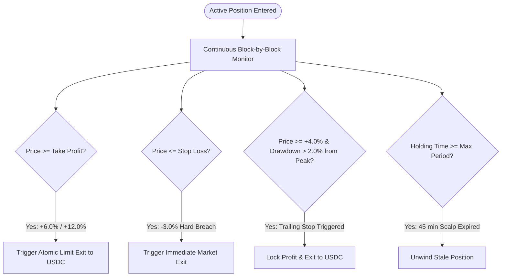

# NEXORA — Quantitative Trading Strategy Specification

> **Document Version:** 1.0.0  
> **Status:** Approved Baseline Strategy Specification  
> **Target Track:** Solana Hackathon — AI & DeFi Infrastructure  
> **Document Identifier:** NEX-STRAT-V1  
> **Companion Directory:** [`docs/strategy/`](file:///e:/hackathon_solana/docs/strategy)  

---

## 1. Strategy Overview & Philosophy

The Nexora **Dynamic Momentum & Liquidity Harvester (DMLH-v1)** is an institutional-grade, multi-factor quantitative strategy designed natively for Solana onchain liquidity pools (primarily **Meteora DLMM & dynamic AMMs** and **Jupiter Aggregator** routes).

### Core Quantitative Philosophy
1. **Deterministic & Backtestable:** Every signal, factor weight, and exit rule is derived from verifiable mathematical formulas without subjective heuristics.
2. **Onchain Liquidity Awareness:** Evaluates pool depth, tick-level bin concentration, and slippage curves before momentum indicators to prevent toxic flow and MEV front-running.
3. **Multi-Horizon Position Management:** Enforces tight, algorithmic risk bounds (Take Profit, Stop Loss, Trailing Stops, Time Invalidation) with automated capital recycling.

---

## 2. Multi-Factor Opportunity Scoring Model (0–100)

The Opportunity Score ($S_{\text{opp}}$) is a continuous composite metric bounded between `0.0` and `100.0`. It evaluates 10 quantitative dimensions grouped into three core pillars:

```
┌─────────────────────────────────────────────────────────────────────────────┐
│                          OPPORTUNITY SCORING MATRIX                         │
├─────────────────────┬──────────────────────────┬────────────────────────────┤
│ PILLAR 1: LIQUIDITY │ PILLAR 2: ORDER FLOW     │ PILLAR 3: STRUCTURE & RISK │
│     & SAFETY (35%)  │     & MOMENTUM (40%)     │        (25%)               │
├─────────────────────┼──────────────────────────┼────────────────────────────┤
│ • Base Liquidity 15%│ • Vol Acceleration 15%  │ • Market Structure 10%     │
│ • Liquidity Delta 10%│ • Price Momentum 15%    │ • Volatility Quality 8%    │
│ • Token Security 10%│ • Buy/Sell Pressure 10%  │ • Concentration Risk 7%    │
└─────────────────────┴──────────────────────────┴────────────────────────────┤
│ *Social Signals: 0% Weight in MVP (Reserved for Post-MVP sentiment feed)   │
└─────────────────────────────────────────────────────────────────────────────┘
```

### 2.1 Weighting Analysis & Justification
Naive crypto strategies over-index on raw price momentum (40–50%), leading to catastrophic slippage and rug-pull traps on low-liquidity pairs. 

Nexora implements a **Liquidity-First Weighting Structure**:
- **35% Liquidity & Token Security:** Ensures capital can enter and exit with $< 0.15\%$ price impact.
- **40% Order Flow & Momentum:** Captures explosive volume acceleration and directional buy pressure.
- **25% Market Structure & Risk:** Verifies trend alignment and filters out whale wallet manipulation.

---

## 3. Decision Thresholds & Actions

```
[0.0] ────────────── [45.0] ────────────── [60.0] ────────────── [75.0] ────────────── [100.0]
        AVOID                  HOLD                  WATCH                   BUY
   (Toxic / Illiquid)     (Sub-Threshold)       (High Potential)       (Execution Ready)
```

| Threshold Range | Action Category | System Behavior |
|---|---|---|
| **$S_{\text{opp}} \ge 75.0$** | **`BUY`** | Triggers AI Contextual Reasoner ➔ Deterministic Risk Evaluation ➔ Execution Pipeline. |
| **$60.0 \le S_{\text{opp}} < 75.0$** | **`WATCH`** | Added to High-Frequency Watchlist (1s poll interval). |
| **$45.0 \le S_{\text{opp}} < 60.0$** | **`HOLD`** | Evaluated for existing open positions; no new entries permitted. |
| **$S_{\text{opp}} < 45.0$** | **`AVOID`** | Automatically discarded; blacklisted from loop for 15 minutes if security flags fail. |

---

## 4. Entry & Exit Invariant Rules

### 4.1 Entry Conditions (All Must Be True)
1. Composite Score $S_{\text{opp}} \ge 75.0$.
2. Token Security Invariant = `PASS` (Mint Authority Revoked, Freeze Authority Disabled, LP Locked $\ge 90\%$).
3. Simulated Jupiter Price Impact $< 0.50\%$ at target size.
4. Total open positions $< 3$.
5. Portfolio 24h drawdown $>-5.0\%$.

### 4.2 Exit Conditions & Risk Parameters



| Parameter | Value | Description |
|---|---|---|
| **Stop Loss (SL)** | `-3.0%` (Hard) | Maximum permissible loss from initial entry price. |
| **Take Profit 1 (TP1)** | `+6.0%` (50% size) | First target to de-risk and lock capital. |
| **Take Profit 2 (TP2)** | `+12.0%` (Remaining) | Runner target for extended momentum continuation. |
| **Trailing Stop** | `2.0%` trail | Activates once position gains $> +4.0\%$. |
| **Max Hold Time** | `45 minutes` | Auto-liquidates stale positions lacking follow-through. |
| **Max Trade Sizing** | `10.0%` Equity | Maximum capital allocated to any single trade. |
| **Loss Cooldown** | `15 minutes` | Mandatory pause on the same token pair following a stop-out. |
| **Exit Cooldown** | `5 minutes` | Mandatory pause before re-entering a previously closed profitable pair. |

---

## 5. Strategy Documentation Index

The strategy specification is partitioned into modular deep-dive documents:

1. 📄 **[`strategy.md`](file:///e:/hackathon_solana/docs/strategy/strategy.md):** Core Strategy Architecture, Regime Switching & Multi-Timeframe Signals.
2. 📄 **[`signals.md`](file:///e:/hackathon_solana/docs/strategy/signals.md):** Mathematical Signal Definitions, Formulas & Normalization Logic.
3. 📄 **[`scoring.md`](file:///e:/hackathon_solana/docs/strategy/scoring.md):** The 0–100 Opportunity Scoring System, Factor Weights & Sensitivity Analysis.
4. 📄 **[`position-sizing.md`](file:///e:/hackathon_solana/docs/strategy/position-sizing.md):** Volatility-Adjusted Fractional Kelly & Risk-Parity Sizing Engine.
5. 📄 **[`exit-rules.md`](file:///e:/hackathon_solana/docs/strategy/exit-rules.md):** Deterministic Exit Engine, Trailing Stop Math & Cooldown Invariants.
