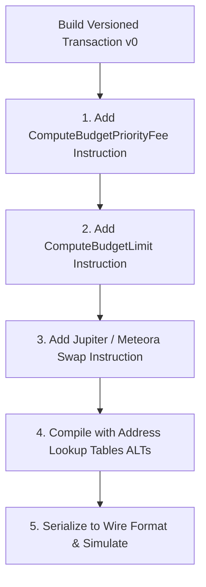
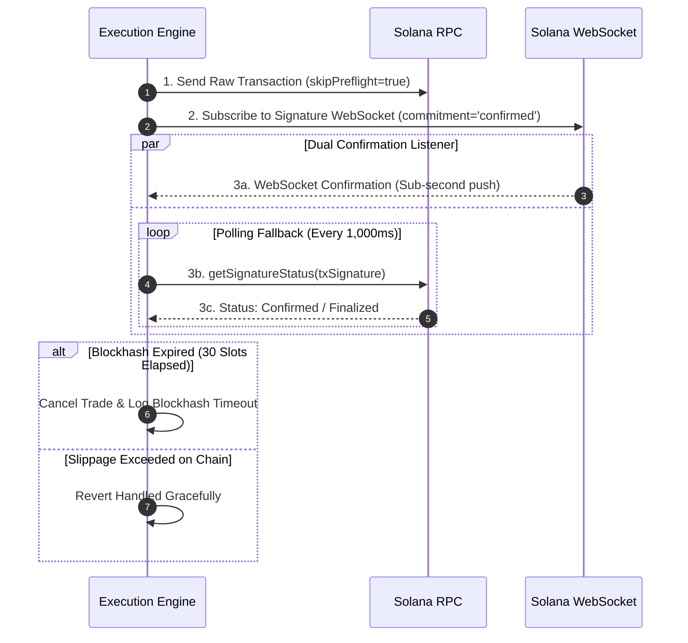

# NEXORA — Solana-Specific Architecture & Onchain Integration Specification

> **Document Version:** 1.0.0  
> **Status:** Approved Baseline Architecture  
> **Target Track:** Solana Hackathon — AI & DeFi Infrastructure  
> **Document Identifier:** NEX-SOL-V1  
> **Core Doctrine:** **DELEGATED, POLICY-BOUNDED ONCHAIN CAPITAL EXECUTION.**  

---

## 1. Solana Ecosystem Overview & Architectural Pillars

NEXORA leverages Solana's high-throughput, low-latency execution environment (400ms block times, sub-second finality, micro-penny transaction costs) to execute institutional-grade autonomous trading and capital allocation.

### Core Ecosystem Integrations:
1. **Solana Core Runtime (`@solana/web3.js` v1 / v2 ready):** Versioned Transactions (v0), Address Lookup Tables (ALTs), and Compute Budget dynamic prioritization.
2. **Jupiter v6 Aggregator (`@jup-ag/api`):** Ultra-low slippage multi-hop routing, split liquidity trades, and direct swap instruction deserialization.
3. **Meteora DLMM & Dynamic AMM (`@meteora-ag/dlmm`):** Discrete bin liquidity routing, dynamic volatility fee harvesting, and localized tick analysis.
4. **Onchain Vault & Policy Layer (`programs/vault`):** Non-custodial, policy-gated smart contract program delegating bounded execution authority to the agent without surrendering user master keys.

```
┌─────────────────────────────────────────────────────────────────────────────┐
│                       SOLANA ONCHAIN CAPITAL PIPELINE                       │
├─────────────────────────────────────────────────────────────────────────────┤
│                                User / Trader                                │
│                                      ↓                                      │
│                         Non-Custodial Vault (PDA)                           │
│                                      ↓                                      │
│                            Agent Authorization                              │
│                                      ↓                                      │
│                           Onchain Policy Check                              │
│                                      ↓                                      │
│                        Atomic DEX Execution (CPI)                           │
│                             /              \                                │
│                            /                \                               │
│                    Jupiter v6 Swap      Meteora DLMM                        │
└─────────────────────────────────────────────────────────────────────────────┘
```

---

## 2. Wallet & Delegated Keypair Architecture

The agent **never holds or accesses the user's primary wallet private keys**. Nexora provides two decoupled wallet operating modes:

```
┌───────────────────────────────────────┬───────────────────────────────────────┐
│ MODE A: BROWSER WALLET ADAPTER        │ MODE B: EPHEMERAL DELEGATED SESSION   │
├───────────────────────────────────────┼───────────────────────────────────────┤
│ • Interactive Web3 mode.              │ • Autonomous high-frequency mode.     │
│ • Uses Phantom, Solflare, Backpack.   │ • User funds a sandboxed local keypair│
│ • User signs transactions per cycle.  │   with capped capital (e.g. 50 USDC). │
│ • Ideal for manual validation & audit.│ • Agent signs micro-swaps instantly.  │
│ • Zero key storage in memory/disk.    │ • Keys in RAM only; 1-click revoke.   │
└───────────────────────────────────────┴───────────────────────────────────────┘
```

---

## 3. Onchain Vault & Policy Program Architecture (`programs/vault`)

For full non-custodial delegation, Nexora designs an Anchor-based smart contract vault:

```rust
// Conceptual Anchor Program Structure (programs/vault/src/lib.rs)

use anchor_lang::prelude::*;
use anchor_spl::token::{self, Token, TokenAccount, Transfer};

#[program]
pub mod nexora_vault {
    use super::*;

    pub fn initialize_vault(ctx: Context<InitializeVault>, policy: VaultPolicy) -> Result<()> {
        let vault = &mut ctx.accounts.vault;
        vault.owner = ctx.accounts.owner.key();
        vault.agent = ctx.accounts.agent.key();
        vault.policy = policy;
        vault.daily_spent_usdc = 0;
        vault.last_reset_slot = Clock::get()?.slot;
        Ok(())
    }

    pub fn execute_swap(
        ctx: Context<ExecuteSwap>,
        amount_in: u64,
        min_amount_out: u64,
        dex_program_id: Pubkey,
    ) -> Result<()> {
        let vault = &mut ctx.accounts.vault;
        let clock = Clock::get()?;

        // 1. Authenticate caller is approved agent
        require_keys_eq!(ctx.accounts.signer.key(), vault.agent, VaultError::UnauthorizedAgent);

        // 2. Deterministic Onchain Policy Verification
        require!(amount_in <= vault.policy.max_single_trade_usdc, VaultError::TradeSizeExceeded);
        require!(vault.daily_spent_usdc + amount_in <= vault.policy.max_daily_limit_usdc, VaultError::DailyLimitExceeded);

        // 3. Update state
        vault.daily_spent_usdc += amount_in;

        // 4. CPI to Jupiter / Meteora
        // ... (Execute atomic CPI swap)
        Ok(())
    }
}

#[account]
pub struct Vault {
    pub owner: Pubkey,
    pub agent: Pubkey,
    pub policy: VaultPolicy,
    pub daily_spent_usdc: u64,
    pub last_reset_slot: u64,
}

#[derive(AnchorSerialize, AnchorDeserialize, Clone, Copy)]
pub struct VaultPolicy {
    pub max_single_trade_usdc: u64,
    pub max_daily_limit_usdc: u64,
    pub max_slippage_bps: u16,
    pub is_active: bool,
}
```

---

## 4. Generic Execution Provider Abstraction

To ensure clean architecture and testability, all onchain swaps are abstracted through the `ExecutionProvider` interface:

```typescript
// packages/execution/src/types.ts

export interface SwapQuoteRequest {
  inputMint: string;
  outputMint: string;
  amount: bigint;
  slippageBps: number;
}

export interface SwapQuoteResponse {
  providerName: "JUPITER" | "METEORA" | "PAPER";
  inputAmount: bigint;
  expectedOutputAmount: bigint;
  minimumOutputAmount: bigint;
  priceImpactPct: number;
  feeUsdc: number;
  routePlan: any;
}

export interface ExecutionReceipt {
  success: boolean;
  signature?: string;
  slot?: number;
  inputAmount: bigint;
  outputAmount: bigint;
  executionPrice: number;
  computeUnitsConsumed: number;
  error?: string;
}

export interface ExecutionProvider {
  readonly name: string;
  getQuote(request: SwapQuoteRequest): Promise<SwapQuoteResponse>;
  buildSwapTransaction(quote: SwapQuoteResponse, userPublicKey: string): Promise<VersionedTransaction>;
  executeSwap(transaction: VersionedTransaction, signer: Keypair | WalletAdapter): Promise<ExecutionReceipt>;
  simulateSwap(transaction: VersionedTransaction): Promise<{ success: boolean; logs: string[]; computeUnits: number }>;
}
```

### Implementations:
1. **`JupiterExecutionProvider`:** Leverages `@jup-ag/api` for multi-DEX aggregation, split routes, and optimal price discovery.
2. **`MeteoraExecutionProvider`:** Directly interfaces with `@meteora-ag/dlmm` for targeted active bin swaps and dynamic fee optimization.
3. **`PaperExecutionProvider`:** Simulates live mainnet execution with zero capital risk for forward strategy testing.

---

## 5. Transaction Construction & Serialization

Nexora constructs **Solana Versioned Transactions (v0)** with Address Lookup Tables (ALTs) to minimize payload size and maximize reliability:



### 1. Compute Budget Optimization
Every transaction prepends two deterministic compute budget instructions:
- `ComputeBudgetProgram.setComputeUnitLimit({ units: 350_000 })` — Tailored to prevent overpaying for compute allocation.
- `ComputeBudgetProgram.setComputeUnitPrice({ microLamports: dynamicPriorityFee })` — Dynamically computed from `getRecentPrioritizationFees` (targeting the 75th percentile of recent blocks).

---

## 6. Transaction Simulation & Pre-Flight Verification

Before any transaction is signed or broadcast, the Execution Engine executes an RPC pre-flight simulation:

```typescript
// packages/execution/src/simulator.ts

export async function simulateTransactionSafe(
  connection: Connection,
  transaction: VersionedTransaction
): Promise<SimulationResult> {
  const result = await connection.simulateTransaction(transaction, {
    sigVerify: false,
    replaceRecentBlockhash: true,
    commitment: "confirmed",
  });

  if (result.value.err) {
    return {
      success: false,
      error: parseSimulationError(result.value.err, result.value.logs),
      logs: result.value.logs || [],
      computeUnits: result.value.unitsConsumed || 0,
    };
  }

  return {
    success: true,
    logs: result.value.logs || [],
    computeUnits: result.value.unitsConsumed || 0,
  };
}
```

---

## 7. Confirmation Strategy & Failure Handling



### Confirmation Invariants:
1. **Target Commitment:** `confirmed` (66%+ validator cluster votes) for position accounting; `finalized` for permanent ledger audits.
2. **Blockhash Validity Window:** 30 slots (~12 seconds). Transactions not included within 30 slots are discarded to prevent stale execution.
3. **RPC Resilience:** Automatic round-robin fallback across 3 independent RPC providers (e.g. Helius, Triton, QuickNode) if latency exceeds 1,200ms.

---

## 8. Token Metadata & Verification Pipeline

Before any asset is added to candidate market discovery, the `TokenSecurityScanner` verifies onchain account flags:

```typescript
// packages/data/src/token-verifier.ts

export interface TokenSecurityReport {
  isMintRenounced: boolean;
  isFreezeDisabled: boolean;
  isVerifiedOnJupiter: boolean;
  isToken2022: boolean;
  hasTransferFee: boolean;
  isSafe: boolean;
}

export async function verifyTokenSecurity(
  connection: Connection,
  mintAddress: PublicKey
): Promise<TokenSecurityReport> {
  const mintAccountInfo = await connection.getAccountInfo(mintAddress);
  // Parse Mint Account data (SPL Token or Token-2022)
  const isMintRenounced = mintData.mintAuthorityOption === 0;
  const isFreezeDisabled = mintData.freezeAuthorityOption === 0;
  
  // Verify Transfer Fee extension
  const hasTransferFee = checkToken2022TransferFeeExtension(mintAccountInfo);

  const isSafe = isMintRenounced && isFreezeDisabled && !hasTransferFee;

  return {
    isMintRenounced,
    isFreezeDisabled,
    isVerifiedOnJupiter: checkJupiterStrictList(mintAddress.toBase58()),
    isToken2022: mintAccountInfo.owner.equals(TOKEN_2022_PROGRAM_ID),
    hasTransferFee,
    isSafe,
  };
}
```

---

## 9. Environment Configurations & Network Defaults

```
┌─────────────────────────────────────────────────────────────────────────────┐
│                       NETWORK CONFIGURATION MATRIX                          │
├─────────────────────┬──────────────────────────┬────────────────────────────┤
│ PARAMETER           │ DEVNET (DEFAULT)         │ MAINNET-BETA (OPT-IN ONLY) │
├─────────────────────┼──────────────────────────┼────────────────────────────┤
│ RPC Endpoint        │ https://api.devnet.solana│ User-configured RPC url    │
│ Quote Currency      │ Devnet Mock USDC (Faucet)│ Real SPL USDC Mint         │
│ Default Mode        │ Active on launch         │ Locked / Manual signature  │
│ Max Position Size   │ $100.00 Mock USDC        │ $250.00 USDC (MVP Hard Cap)│
│ DEX Execution       │ Jupiter Mock / Devnet AMM│ Live Jupiter v6 + Meteora  │
└─────────────────────┴──────────────────────────┴────────────────────────────┘
```

1. **Devnet by Default:** All initial development, automated tests, and demo runs operate against Solana Devnet or simulated Paper Trading.
2. **Mainnet Activation Protocol:** Mainnet execution requires explicit UI toggle, risk disclaimer acknowledgment, and wallet authentication.
