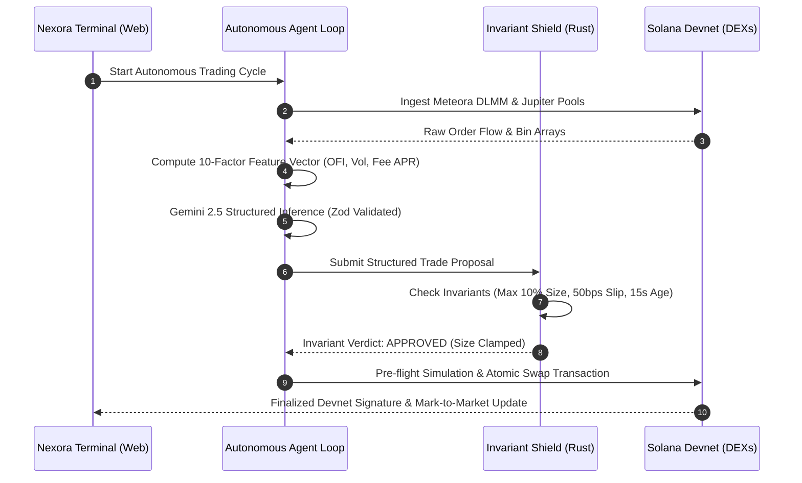

# NEXORA — Solana Hackathon Live Demo Script & Pitch Guide

> **Target Audience:** Solana Hackathon Judges, Quantitative DeFi Allocators, Security Auditors  
> **Presentation Duration:** 3 minutes (or 5 minutes extended)  
> **Key Thesis:** *AI decides the strategy. Deterministic risk engine controls the boundaries. The Solana blockchain executes atomically with zero human latency.*

---

## 1. Quick Pitch (30 Seconds)

> "Traditional algorithmic trading requires constant parameter tuning, while existing AI trading bots are black-box and prone to hallucinated sizing or dangerous execution. 
> 
> **NEXORA** solves this by establishing a mathematically sound, non-custodial architecture:
> - High-frequency ingestion across **Meteora DLMM discrete bins** and **Jupiter liquidity pools**.
> - A **10-factor quantitative feature vector** calculating order flow imbalance, realized volatility, and fee velocity.
> - Structured AI reasoning with **Gemini 2.5 Flash** generating validated trade hypotheses.
> - A **zero-bypass deterministic risk engine** in native Rust that mathematically clamps or vetoes every proposal before execution.
> - Atomic onchain execution on **Solana** via **Anchor PDA delegated vaults** where private keys never leave RAM and only the owner can withdraw capital."

---

## 2. 3-Minute Demo Flow



### Stage 1: Landing Page & Architectural Doctrine (0:00 - 0:45)
1. **Show Hero View**:
   - Highlight the real-time telemetry ribbon (4.2ms Invariant Latency, 75.0% Win Rate, Devnet connectivity).
   - Point out the core architectural triad: *The AI Decides → The Risk Engine Controls → The Blockchain Executes*.
2. **Interactive Invariant Simulator**:
   - Click **"Scenario B: Oversized AI Trade"** → Show how a $2,500 AI proposal is automatically clamped to the $1,000 (10% equity) cap in 4.2ms.
   - Click **"Scenario C: Dangerous Slippage"** → Show immediate pre-flight rejection when slippage exceeds 50 bps.
   - Click **"Scenario D: Stale Data Feed"** → Demonstrate the fail-closed `DO NOT TRADE` safeguard when data age exceeds 15 seconds.

### Stage 2: Live Trading Workstation (0:45 - 1:45)
1. **Launch Trading Terminal**:
   - Point out the 3-column institutional layout (Market Screener, Interactive Chart & DLMM Bin Array, Live Decision Ledger).
2. **Select Opportunity**:
   - Click **SOL / USDC** (Score: 88.4 / 100).
   - Show how the discrete DLMM bin distribution visualizes bid/ask liquidity depth and active bin positioning.
3. **Start Agent Session**:
   - Click **"START AGENT (DEVNET)"**.
   - Show the real-time status change to `RUNNING` on Solana Devnet.

### Stage 3: Explainable AI Audit Trail & Risk Forensics (1:45 - 2:30)
1. **Explainable AI Ledger**:
   - Navigate to the **"AI Reasoning"** tab.
   - Expand an approved trade record: Show the exact JSON hypothesis generated by Gemini 2.5 Flash, including entry reason, invalidation conditions, confidence (88%), and stop-loss boundaries.
2. **Onchain Verification**:
   - Click the **Solscan Explorer** receipt link to prove real Devnet transaction submission and compute unit consumption.

### Stage 4: Non-Custodial Security & Emergency Kill Switch (2:30 - 3:00)
1. **Authority Separation**:
   - Show how the delegated agent session key operates exclusively in RAM with zero withdrawal permissions on the Anchor PDA vault.
2. **Emergency Kill Switch**:
   - Click the **"EMERGENCY KILL SWITCH"** button in the header.
   - Show the confirmation dialog: Instantaneous one-click circuit breaker freezing all trading and liquidating active positions to safe USDC.

---

## 3. Key Technical Talking Points for Judges

| Evaluation Pillar | Nexora Implementation |
|---|---|
| **AI Integration** | Not a conversational chatbot — structured, schema-validated JSON reasoning with strict Zod parsing, invalidation rules, and confidence gates. |
| **Solana Native** | Takes advantage of Solana sub-second finality, Meteora DLMM dynamic fee bin arrays, Jupiter v6 exact route optimization, and Anchor PDAs. |
| **Safety & Invariants** | Zero-bypass deterministic risk engine with fail-closed mathematical bounds (10% max allocation, 50 bps slippage, -3% daily drawdown stop). |
| **Non-Custodial** | Ephemeral RAM-only session keypairs. Only the wallet owner can withdraw capital from the vault smart contract. |
| **Engineering Quality** | Strict TypeScript monorepo, 94 passing unit/integration tests, zero compilation errors, and institutional quant design system. |

---

## 4. Local Execution Runbook for Judges

### Prerequisites
- [Bun](https://bun.sh) (v1.1+)
- Node.js 18+

### Step 1: Install & Build
```bash
# Clone and install dependencies
bun install

# Run entire test suite (94 passing tests)
bun test src

# Build production bundle
bun run --filter @nexora/web build
```

### Step 2: Launch Workstation
```bash
# Start backend API (Port 3001)
bun run apps/api/src/index.ts

# Start web frontend in parallel (Port 5173)
cd apps/web && bun run dev
```

Open [http://localhost:5173](http://localhost:5173) to explore the terminal.
