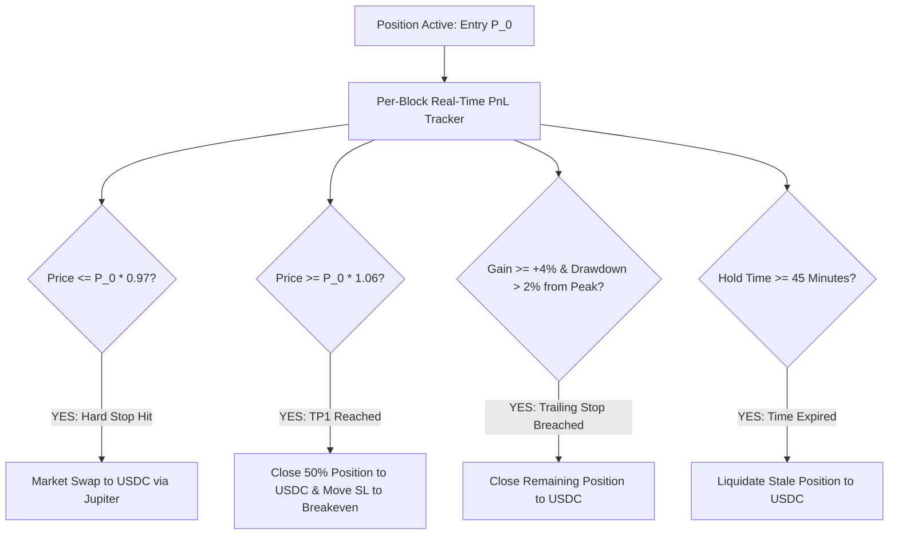

# NEXORA Strategy — Deterministic Exit Rules & Cooldown Invariants

> **Module:** Exit & Risk Engine (`packages/strategy` + `packages/risk-engine`)  
> **Identifier:** NEX-EXITS-V1  
> **Companion Files:** [`position-sizing.md`](file:///e:/hackathon_solana/docs/strategy/position-sizing.md), [`strategy.md`](file:///e:/hackathon_solana/docs/strategy/strategy.md)  

---

## 1. Exit Philosophy & Execution Mandate

The primary determinant of long-term trading expectancy is **asymmetric exit discipline**. In Nexora:
- Entries are probabilistic.
- **Exits are 100% deterministic.**
- No AI model, user intervention, or emotional hesitation is permitted to delay an invalidation stop.

---

## 2. Multi-Stage Exit Architecture

---

## 3. Exit Invariant Specifications

### 3.1 Hard Stop Loss (SL)
- **Threshold:** $-3.0\%$ from initial fill price $P_0$.
- **Execution:** Immediate market swap to USDC via Jupiter aggregator.
- **Slippage Tolerance on SL:** $100\text{ bps}$ (Prioritizes guaranteed fill over price sensitivity).

### 3.2 Tiered Take Profit (TP1 & TP2)
- **Take Profit 1 (TP1):** $+6.0\%$ gain. Closes **$50\%$** of position size to lock baseline profit and immediately resets Stop Loss of remaining 50% to **Breakeven ($P_0$)**.
- **Take Profit 2 (TP2):** $+12.0\%$ gain. Closes the remaining **$50\%$** position.

### 3.3 Dynamic Trailing Stop
- **Activation Condition:** Current price reaches $\ge +4.0\%$ unrealized profit.
- **Trailing Distance:** Tracks $2.0\%$ below the highest recorded peak price $P_{\text{peak}}$.
- **Formula:** $\text{Exit Trigger} = P_{\text{peak}} \times (1.0 - 0.02)$.

### 3.4 Maximum Holding Period (Time-Based Invalidation)
- **Threshold:** **45 Minutes** for standard momentum scalps.
- **Rationale:** If an explosive onchain breakout fails to achieve TP1 within 45 minutes, momentum has dissipated and capital must be freed.

---

## 4. Cooldown Invariants & Churn Prevention

To prevent destructive revenge-trading or execution churn during choppy market regimes:

| Cooldown Type | Duration | Trigger Condition | Scope |
|---|---|---|---|
| **Loss Cooldown** | **15 Minutes** | Position exited at a loss (SL triggered). | Specific Token Pair |
| **Exit Cooldown** | **5 Minutes** | Position exited profitably (TP triggered). | Specific Token Pair |
| **Consecutive Loss Halt** | **60 Minutes** | 2 consecutive losses across any pairs. | Entire Autonomous Agent Loop |
| **Global Circuit Breaker** | **24 Hours / Manual**| Portfolio 24h drawdown breaches $-5.0\%$. | Global Kill-Switch Trip |
